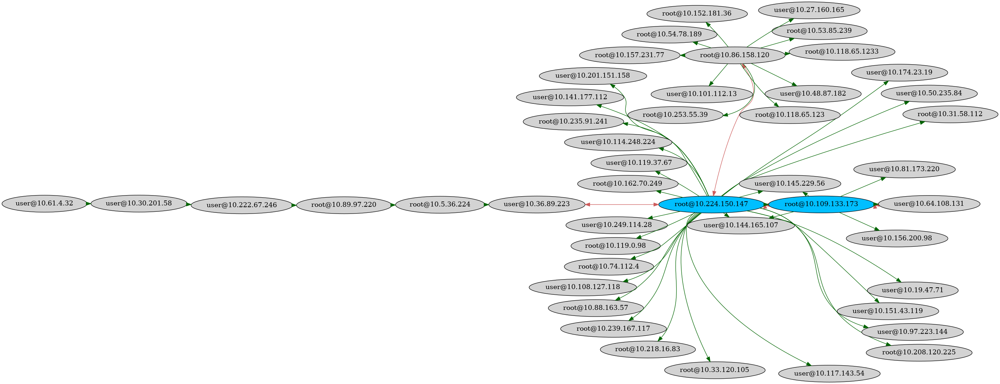
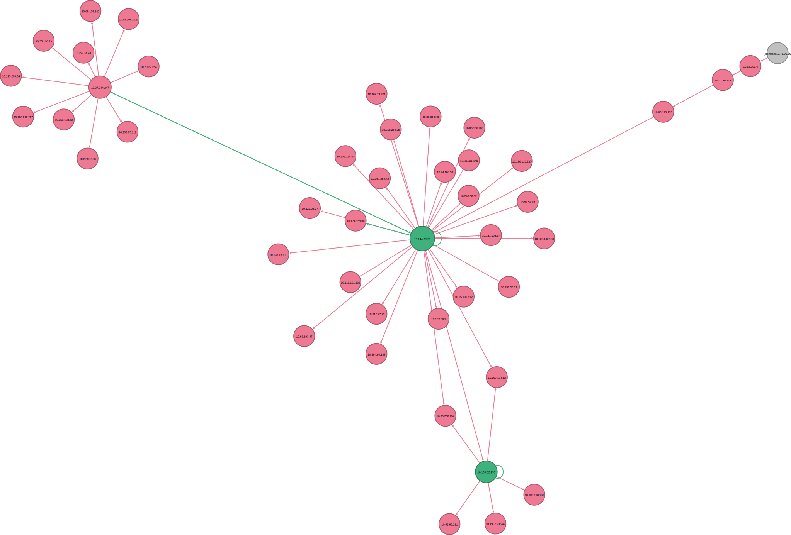
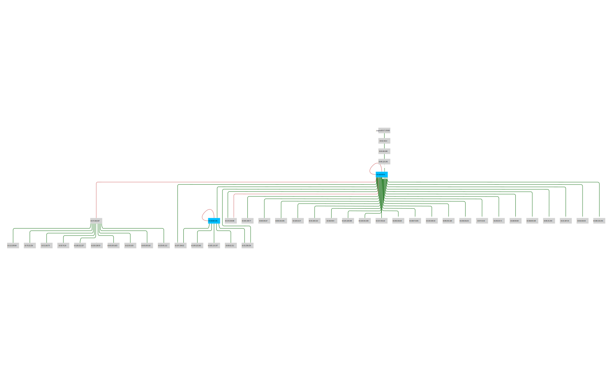

# Visualizing System Relationships


SSH-Snake's output can be used to create visualizations of the network it has traversed. For example, using the python script _generate-graph.py_ provided in [tools/](tools/), we can generate a PNG visualizing the network:


In [this image](tools/SSH-Snake-dot-circo.png), the blue nodes indicate a destination that can connect to itself (meaning a key on the system is also trusted by `authorized_keys`). The red edges/lines indicate that the connection from one system to another is bi-directional, meaning system A can SSH to system B and system B can SSH to system A. Note that this image includes usernames in the system labels.

This graph was created using the command:

```bash
python3 tools/generate-graph.py --with-users --file SSHSnake.log --format dot
circo -Tpng -Goverlap=false -Gsplines=true -Gconcentrate=true -Gnodesep=0.1 -Goverlap=false SSHSnake_dot_file.dot -o SSH-Snake-dot-circo.png
```

which first generates a [dot file](https://en.wikipedia.org/wiki/DOT_(graph_description_language), then uses [graphviz' circo](https://graphviz.org/docs/layouts/circo/) to generate a PNG.

---

An alternative visualization can be created in [gexf format](https://gexf.net/), and then [Gephi](https://gephi.org/users/download/) can be used to create another meaningful image:



In [this image](tools/SSH-Snake-Gephi.svg), the green nodes indicate a _host_ (without a username) that can connect to itself, and green lines/edges indicate that the connection is bi-directional. The gray host in the top right corner is the host that the script was initially executed on. Note that the hosts do __not__ include the usernames of the system, and this visualization indicates system to system connections, rather than destination (`user@host`) to destination (`user@host`) connections.

This graph was created using the command (note the lack of `--with-users`):

```bash
python3 tools/generate-graph.py --file SSHSnake.log --format gexf
```

Using Gephi, the final image was generated.

---

Cytoscape is another tool that can be used to generate interesting graphs. Using the same gexf format output file from before, you can install the gexf-app app for Cytoscape and import the file.

|The blue nodes indicate the _destination_ can connect to itself (user@host<-->user@host). The red edges indicate that the connection is bi-directional (user1@host1<-->user2@host2).|

Not only can you create an image like this in Cytoscape (using the "yFiles hierarchical Layout"), you can also create webpages like this one: [https://megamansec.github.io/SSH-Snake/](https://megamansec.github.io/SSH-Snake/#/).
