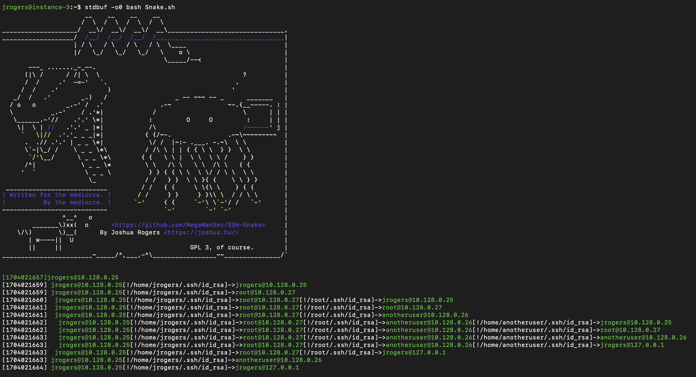

# SSH-Snake: Automated SSH-Based Network Traversal

🐍 SSH-Snake is a powerful tool designed to perform automatic network traversal using SSH private keys discovered on systems, with the objective of creating a comprehensive map of a network and its dependencies, identifying to what extent a network can be compromised using SSH and SSH private keys starting from a particular system.

SSH-Snake can automatically reveal the relationship between systems which are connected via SSH, which would normally take a tremendous amount of time and effort to perform manually.

In other words, SSH-Snake performs the following tasks automatically and recursively:

1. On the current system, find any SSH private keys,
2. On the current system, find any hosts or destinations (`user@host`) that the private keys may be accepted,
3. Attempt to SSH into all of the destinations using all of the private keys discovered,
4. If a destination is successfully connected to, repeats steps #1 - #4 on the connected-to system.

It's completely self-replicating and self-propagating -- and completely fileless. In many ways, SSH-Snake is actually a [worm](https://en.wikipedia.org/wiki/Computer_worm): It replicates itself and spreads itself from one system to another as far as it can.

Instead of manually jumping between systems with SSH keys like it's a Super Mario game, let SSH-Snake do the work for you.

Although this tool is intended for hacking purposes, sysadmins can also use it to better understand their infrastructure and network. If you want to disable the printing of private keys discovered, [comment out this line of code](https://github.com/MegaManSec/SSH-Snake/blob/7ae7ef0afe0e067a1b96f69e508df52831a08b8b/Snake.sh#L964).

An in-depth look at how this script actually works, technical details, interesting discoveries, design decisions, benchmarking, and lessons learnt, check out [this blog post](https://joshua.hu/ssh-snake-ssh-network-traversal-discover-ssh-private-keys-network-graph).

# Screenshots


|A reduced screenshot from the output of SSH-Snake in a very small network.|
|:-:|

---

|The blue nodes indicate the _destination_ can connect to itself (user@host<-->user@host). The red edges indicate that the connection is bi-directional (user1@host1<-->user2@host2).|
|:-:|

---


|The green nodes indicate a _host_ (without a username) that can connect to itself (host1<-->host1). The green edges indicate that the connection is bi-directional (host1<-->host2). The gray host in the top right corner is the host that the script was initially executed on.|
|:-:|

---

|The blue nodes indicate the _destination_ can connect to itself (user@host<-->user@host). The red edges indicate that the connection is bi-directional (user1@host1<-->user2@host2).|
|:-:|


# Using and Running SSH-Snake

SSH-Snake can either be downloaded or piped into bash:

```bash
wget https://raw.githubusercontent.com/MegaManSec/SSH-Snake/main/Snake.nocomments.sh
bash ./Snake.nocomments.sh
```

or

```bash
curl https://raw.githubusercontent.com/MegaManSec/SSH-Snake/main/Snake.nocomments.sh | bash
```

# About SSH-Snake

SSH-Snake seamlessly emulates what a human adversary would do to discover SSH private keys and destinations where they can be used to connect to. Written entirely in Bash, it operates with a minimal set of dependencies commonly available on major Linux (and MacOS) systems: `bash`, `ssh`, `coreutils`, `awk`, `uniq`, `sort`, `grep`, `tr`, `find`, and `cat`. `getent` OR `dscacheutil` is required. `sed` is required for only the very first system. Likewise, `sudo`, `hostname`, `ip`, `timeout`, `arp`, `ifconfig`, `ipconfig`, and `xargs` may also be used, but they are not required (and the script gracefully handles cases where they are not present). If a system is discovered without any of the required packages, it gracefully fails, alerting the user that the scan could not continue on that particular system (and backtracks, continuing from the previous system.)

SSH-Snake is completely fileless: after the user runs the script, it is passed to destinations' bash via stdin and bash arguments (via SSH). No material evidence of the script exists on any of the systems scanned: the only evidence of the script running is in the process tree, and the substantial amount of invalid SSH attempts which will inevitably occur.

SSH-Snake takes a [depth-first approach](https://en.wikipedia.org/wiki/Depth-first_search) to discovery: once it connects to one system, it tries to connect further from that system before backtracking.

The name SSH-Snake comes from the fact that the output of the script looks like a snake slithering up and down the network. However unlike the game Snake, SSH-Snake will not die when it bites its own tail (connects to a systems it has already scanned or is currently scanning): it will simply print how it connected there as normal, but return and not re-scan the destination (in order to avoid infinite recursion).

SSH-Snake has been tested on various flavors of Linux, and MacOS (with Homebrew Bash installed). If you encounter a Linux-based OS it isn't compatible with, please submit a report.

# Features

- Recursively SSH from one system to another using local SSH private keys,
- Fileless traversal and propogation/replication of the SSH-Snake script using only stdin and bash arguments to remote systems,
- Automatic elevation of privileges to root using sudo if possible,
- Discover SSH private key files from `.bash_history` entries,
- Discover SSH private keys from commonly used files and folders,
- Exfiltration SSH private keys as output of the script,
- Configurable custom command execution on each system,
- Plug-and-play modular system to discover private keys and systems,
- Detect hosts from IP ranges, last logins, known hosts, SSH config files, and more,
- Ability to detect when a system has already been scanned or is in the process of being scanned such that a network like A->B->C is able to also discover C->A but does not regress to A->B->C-A->B->C->A->B->....,
- Ability to generate graphical visulizations of a network from the output of the script,
- ... and more.

# Settings

SSH-Snake comes with some general settings that can be configured. These settings are documented in [SETTINGS.md#general-settings](SETTINGS.md#general-settings).

SSH-Snake also comes with a variety configurable/plug-and-play strategies (functions) which can be used to discover SSH private keys on a system and discover hosts and destinations to attempt to connect to. Sane defaults have been provided, however if you want to perform a scan as thoroughly as possible, then enabling more discovery techniques can help. If a scan is taking a long time, disabling some discovery techniques can help. With the exception of one strategy (`find_ssh_keys`), each of the strategies can be toggled off/on. These are documented in [SETTINGS.md#configurable-discovery-strategies](SETTINGS.md#configurable-discovery-strategies).

# Understanding Output

The raw output of SSH-Snake contains a mix of infomation about discovered private keys, destinations, and error messages.

A detailed explanation on the full output of SSH-Snake can be found in [OUTPUT.md](OUTPUT.md).

An example of an output can be found in [example-output.log](/example-output.log).

# Visualizing System Relationships

The output of SSH-Snake can be used to create graphs/visualizations of the network that the script traverses.

A detailed explanation on how to create and interpret images/visualizations from the output of SSH-Snake can be found in [GRAPHICS.md](GRAPHICS.md).

# Other Tools

In addition to the ability to create visualizations of the network that SSH-Snake traverses, three other tools are provided. Namely:

1. `forward-lookup-host.py`: Given a source host or destination, determine all of the systems that can be accessed either directly or indirectly (i.e. through a tertiary system).
2. `reverse-lookup-host.py`: Given a destination host or destination, determine all of the systems that can either directly or indirectly access it.
3. `shortest-path-create-chain.py`: Given host or destination A and B, determine the shortest path connecting the two.

The third tool also generates a command that can be used to connect from destination A to destination B. For example:

```
$ python3 tools/shortest-path-create-chain.py --file output.log --src 'jrogers@10.2.3.4' --dest 'root@10.25.49.1'

Shortest path from jrogers@10.2.3.4 to root@10.25.49.1: jrogers@10.2.3.4->user@10.44.39.21->user@10.19.29.54->root@10.25.49.1

[..]

ssh -i "/home/jrogers/.ssh/key" user@10.44.39.21 'sudo ssh -i "/root/.ssh/id_rsa" user@10.19.29.54 'ssh -i "/tmp/key" root@10.25.49.1''
```

# Snake.sh vs Snake.nocomments.sh

Since the script is quite large, loading the script into a here-document (which it does automatically because the script it actually [a Quine](https://en.wikipedia.org/wiki/Quine_(computing))) [causes bash to write to a temporary file](https://joshua.hu/more-fun-with-bash-ssh-and-ssh-keygen-version-differences) (as it is greater than 65535-bytes).

To cut down on the size such that it remains 100% fileless, Snake.nocomments.sh has a version with all comments, unnecessary white-spaces, and blank lines removed. This cuts the file's size down such that the temporary file is not created by bash.

# Bugs / Issues

If you encounter any bugs or issues related to the script, please report them as a GitHub issue. Please include your configuration setings.

I am particually interested in any interesting `[line]` outputs associated with errors that haven't been caught by the script.

# Limitations

- IPv4 Only: Like all of the best programs, the script does not support IPv6. I can't imagine there will be support for this anytime soon.

- Port 22 Only: There is a general assumption that SSH is running on port 22.

- GNU coreutils: The script relies heavily on GNU coreutils. I have not determined how much (if any) GNU-ism is used in the script.

- The script does not currently look for SSH agent sockets.
